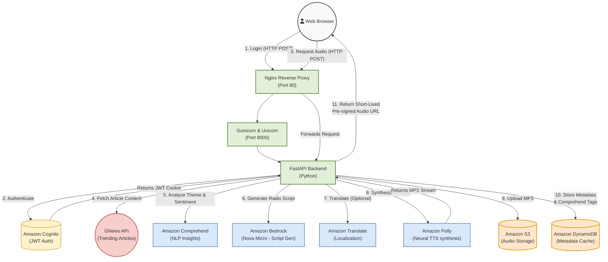

# PaperCast Architecture

This document provides a visual representation of how the PaperCast monolithic application communicates with the various AWS services.

## System Architecture Diagram

This flowchart outlines the synchronous request/response cycle when a user requests an AI-generated sports-radio style podcast from an article URL.

## Component Roles

*   **Nginx (Reverse Proxy)**: Offloads static asset (CSS/JS) processing and handles 120-second AWS API buffering.
*   **Gunicorn**: Python multiprocessor manager ensuring parallel handling of user requests.
*   **FastAPI**: The core backend orchestrator running all logic and enforcing RBAC (Role-Based Access Control) using Cognito cookies.
*   **Amazon Comprehend**: Scrapes the raw article for keywords, entities (people/places), and overall sentiment before processing.
*   **Amazon Bedrock**: Powers the AI host interaction (e.g., Nova Micro models acting as sports radio hosts).
*   **Amazon Translate**: Mutates the Bedrock-generated text script into user-specified target languages.
*   **Amazon Polly**: Maps the targeted language to native-sounding AWS Neural Voices and synthesizes an MP3.
*   **Amazon S3 & DynamoDB**: Acts as the global multi-tenant cache, ensuring consecutive users requesting the same article get an instant `<audio>` playback instead of re-triggering the expensive Bedrock/Polly pipeline.
