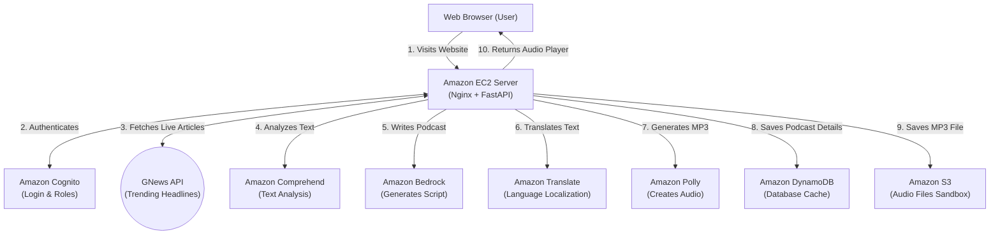

# PaperCast Architecture

This document provides a simple, high-level overview of the systems required to run the application, as outlined in our `infrastructure/manual_setup.md` deployment guide.

## System Flow

## How It Works (Step-by-Step)

The flow is designed to be straightforward, functioning exactly as built during the manual AWS setup:

1.  **The User Interface**: A user visits your application in their browser.
2.  **The Engine (EC2)**: All traffic goes straight to your Amazon EC2 server running your Python code (FastAPI).
3.  **Security (Cognito)**: Before generating any audio, the EC2 server requires the user to log in via Amazon Cognito.
4.  **Live Content**: The dashboard automatically connects to the **GNews API** to fetch real-time trending news articles for the user to select from.
5.  **The AI Factory**: When a user selects or inputs a news article:
    *   **Comprehend** extracts the main themes and entities.
    *   **Bedrock** acts as the radio host, writing the dialogue.
    *   **Translate** converts the script if a different language is chosen.
    *   **Polly** takes that text and reads it aloud, generating an MP3 audio file.
6.  **Storage**: The EC2 server saves the raw MP3 to an **S3 Bucket** and logs the podcast details (like the URL and target language) into the **DynamoDB** table.
7.  **Playback**: The user receives a secure link to the audio file and can play their podcast!
