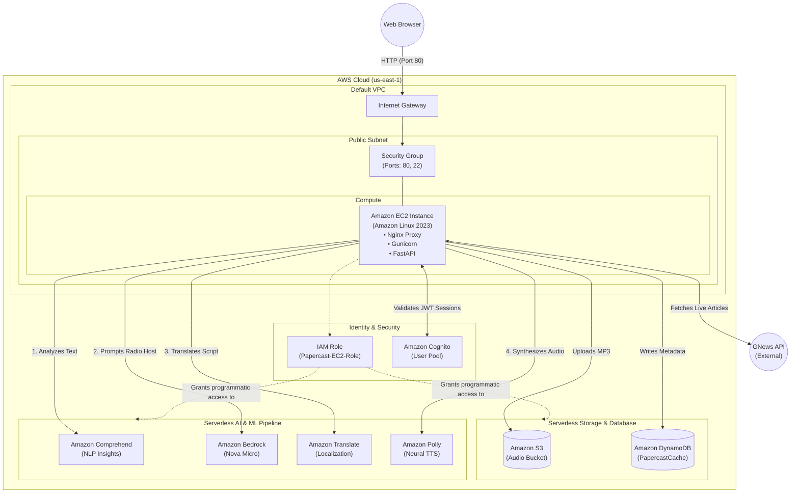

# AWS Cloud Architecture

This diagram provides a structural view of how the PaperCast application is deployed within the Amazon Web Services (AWS) ecosystem.

It highlights the network boundaries, security perimeters (IAM & Cognito), and the serverless AI and Storage services utilized by the core compute instance.

## Infrastructure Diagram

## AWS Services Used

*   **Amazon EC2 (Elastic Compute Cloud)**: The primary host for the Python web application. Sits in a public subnet to receive web traffic.
*   **Amazon VPC (Virtual Private Cloud)**: The overarching network structure providing the Internet Gateway to field incoming browser requests.
*   **AWS IAM (Identity and Access Management)**: An Instance Profile Role attached to the EC2 server, completely removing the need to manage secret API keys on the machine itself.
*   **Amazon Cognito**: A managed User Directory handling frontend sign-up schemas, email verifications, password hashing, and yielding secure JWT tokens to the backend.
*   **Amazon DynamoDB**: A fully managed NoSQL database operating as an ultra-fast global cache, tracking which users have listened to which articles.
*   **Amazon S3 (Simple Storage Service)**: Object storage acting as an audio sandbox, dispensing rapid short-lived streaming URLs back to the frontend dynamically.
*   **AWS AI Services (Bedrock, Polly, Comprehend, Translate)**: A suite of independently managed NLP and Foundational Models orchestrated by the EC2 server using the Boto3 SDK.
