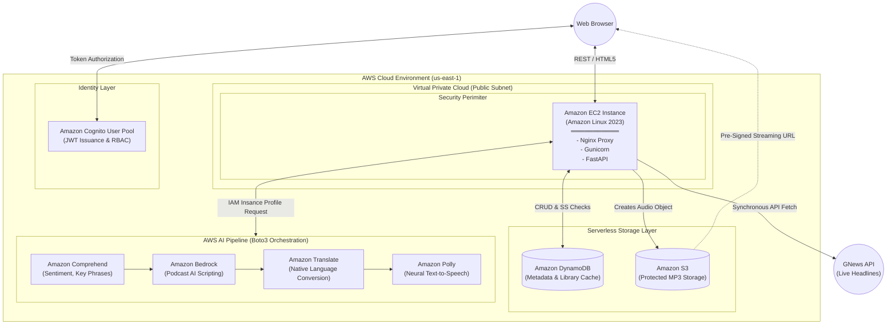

# Project Report

## 1. PROJECT TITLE
**PaperCast: AI-Powered News Podcast Platform**

## 2. PROJECT DESCRIPTION
*   **System Overview**: PaperCast is a secure, cloud-native web application that converts trending written news articles into high-quality, AI-generated, multi-lingual audio podcasts on demand. 
*   **Problem Domain**: Information overload and reading fatigue. Users struggle to consume vast amounts of daily written news efficiently.
*   **Core Technology Used**: Python, FastAPI, Vanilla JavaScript, Bootstrap 5, Amazon Web Services (EC2, S3, DynamoDB, Cognito), and AWS AI Services (Bedrock, Polly, Comprehend, Translate).
*   **Key Capabilities**: Natural language text summarization, multi-voice neural text-to-speech synthesis, NLP sentiment/entity extraction, dynamic language translation, and secure role-based access control.
*   **Target Users**: Commuters, visually impaired users, auditory learners, and professionals seeking efficient ways to consume global news.
*   **Real-world Relevance**: Transforms accessibility to daily information, providing an automated, scalable solution to convert text-heavy media into rich audio experiences.

## 3. APPLICATION SCENARIOS / USE CASES
*   **End-user usage**: A daily commuter logs in via their smartphone, selects a trending technology article, and listens to the AI-generated podcast summary during their drive to work.
*   **Educational usage**: A language student uses the platform to translate native English news into German, listening to the generated neural audio to practice their auditory comprehension skills.
*   **Enterprise usage**: An organization deploys the platform internally to automatically summarize and narrate lengthy industry reports and competitor analyses for their executive team.

## 4. TECHNICAL ARCHITECTURE OVERVIEW

### High-level Architecture Diagram



### Component Interaction & Data/Request Flow
The application adopts a 3-tier Serverless-integrated architecture designed for extreme cost efficiency and scalability on AWS.

*   **Frontend layer**: Server-Side Rendered (SSR) HTML5, CSS3, and Vanilla JavaScript delivered via Jinja2 Templates.
*   **Backend layer**: High-performance FastAPI (Python) server handling asynchronous routing, API orchestration via Boto3, and JWT middleware.
*   **Database layer**: Amazon DynamoDB serves as the NoSQL metadata vault and tracks a multi-tenant String Set (`SS`) cache repository of user libraries. Amazon S3 operates as the object storage sandbox for MP3 audio artifacts.
*   **External APIs / Services**:
    *   **GNews API**: Fetches live, trending news articles directly from external HTTP sources.
    *   **AWS AI Pipeline**: Comprehend (NLP Sentiment/Entities), Bedrock (Summarization via Nova Micro), Translate (Localization), and Polly (Speech Synthesis).
    *   **Amazon Cognito**: Handles user sessions and authorization.
*   **Deployment environment**: A single Amazon Linux 2023 EC2 instance utilizing a systemd-managed Gunicorn application server and an Nginx reverse proxy.

## 5. PREREQUISITES
### 5.1 Software Requirements
*   **Development tools**: Git, pip, virtualenv
*   **IDE**: Visual Studio Code / PyCharm
*   **Runtime environment**: Python 3.9+, Node/Browser environment for testing UI.
*   **Cloud services**: An active AWS Account with IAM permissions for S3, DynamoDB, Bedrock, Polly, Comprehend, and Translate.

### 5.2 Libraries / Frameworks / Dependencies
*   `fastapi`, `uvicorn`: Web framework and ASGI server.
*   `boto3`: AWS SDK for Python.
*   `pydantic`: Data validation.
*   `jinja2`, `python-multipart`: Frontend templating and form handling.
*   `gunicorn`: Production WSGI HTTP Server.

### 5.3 Hardware Requirements (If Applicable)
*   **System specifications**: Dual-core processor, 4GB RAM (Minimum for local dev).
*   **Cloud Hardware**: Amazon EC2 `t3.micro` or `t2.micro` instance.

## 6. PRIOR KNOWLEDGE REQUIRED
To successfully implement and maintain this system, the following technologies and concepts must be understood:
*   **Programming Languages**: Python (for backend logic and AI orchestration) and JavaScript (for vanilla frontend interactivity).
*   **Web Frameworks & Servers**: FastAPI (for backend API routing), Gunicorn (production application server), and Nginx (reverse proxy routing).
*   **External APIs**: Integration with RESTful HTTP services like the **GNews API** to fetch live article payloads.
*   **AWS Services**: 
    *   **Amazon EC2**: Virtual server administration and deployment.
    *   **Amazon S3**: Object storage and pre-signed streaming URLs.
    *   **Amazon DynamoDB**: NoSQL database schema and caching logic.
    *   **Amazon Cognito**: Identity management and JWT token authentication.
    *   **AWS AI Services**: Amazon Bedrock (LLM scripting), Amazon Polly (Text-to-Speech), Amazon Comprehend (NLP Sentiment/Entities), and Amazon Translate (Localization).

## 7. PROJECT OBJECTIVES
*   **Technical objectives**: Build a seamless data pipeline that orchestrates multiple disparate AI services (NLP, LLM, Translation, TTS) into a single, cohesive API endpoint.
*   **Performance objectives**: Ensure audio generation and delivery occur in under 10 seconds, leveraging a robust caching mechanism to eliminate redundant processing.
*   **Deployment objectives**: Successfully host the application on a cost-optimized, secure AWS EC2 instance without hardcoding security credentials.
*   **Learning outcomes**: Master AWS Boto3 integration, FastAPI architecture, Serverless AI orchestration, and cloud security best practices (IAM & Cognito).

## 8. SYSTEM WORKFLOW
1.  **User interaction**: User logs in via Cognito and loads the Dashboard.
2.  **Input handling**: User selects a trending article card or pastes a custom article URL.
3.  **Processing logic**: Backend checks DynamoDB to see if the requested article and language combination has already been processed and cached.
4.  **Core system execution**: If not cached, the text is fetched, passed to Comprehend (for entities/sentiment), Bedrock (for the dual-speaker summary script), Translate (if a foreign language is chosen), and Polly (for MP3 generation).
5.  **Output generation**: The MP3 is uploaded to S3. Metadata, insights, and the `user_id` are saved to DynamoDB via an `UpdateItem` action.
6.  **Response delivery**: A fast, short-lived pre-signed S3 URL is generated and sent back to the frontend custom HTML5 audio player.

## 9. MILESTONE 1: REQUIREMENT ANALYSIS & SYSTEM DESIGN
### 9.1 Problem Definition
End-users suffer from 'reading fatigue' and need an automated way to consume daily news and long-form articles audibly, in different languages, with intelligent summaries.

### 9.2 Functional Requirements
*   Fetch live trending news articles.
*   Convert text into a podcast-style dialogue.
*   Extract key phrases, entities, and sentiment from the text.
*   Translate the podcast script into multiple languages.
*   Maintain a personal library of generated podcasts.

### 9.3 Non-Functional Requirements
*   **Latency**: Caching system must return previously generated podcasts instantly.
*   **Security**: Audio files must not be publicly accessible; API endpoints must be protected by JWT.

### 9.4 System Design Decisions
*   Chose a monolithic FastAPI backend over microservices to reduce architectural complexity and AWS networking costs while maintaining high performance.
*   Chose Amazon DynamoDB over a relational database due to its extreme read-speed for caching and flexible schema for storing varied text insights.

### 9.5 Technology Stack Selection Justification
*   **FastAPI**: Selected for its asynchronous capabilities, crucial when waiting for external AI APIs.
*   **AWS AI Suite**: Bedrock, Polly, Comprehend, and Translate provide enterprise-grade, serverless AI without the overhead of managing local machine-learning models.

## 10. MILESTONE 2: AWS INFRASTRUCTURE SETUP
### 10.1 IAM and Security
Configured an AWS Identity and Access Management (IAM) Role (`Papercast-EC2-Role`) with programmatic access to Bedrock, Polly, Comprehend, Translate, S3, and DynamoDB.
### 10.2 Database & Storage Provisioning
Provisioned `PapercastCache` in Amazon DynamoDB for NoSQL metadata tracking, utilizing a Partition Key of `ArticleID`. Provisioned an Amazon S3 bucket with strict "Block Public Access" policies for MP3 artifact storage.
### 10.3 Identity Management
Deployed an Amazon Cognito User Pool (`Papercast-Users`) for authentication, complete with `admins` and standard user groups for Role-Based Access Control (RBAC).

## 11. MILESTONE 3: BACKEND API & AI INTEGRATION
### 11.1 FastAPI & News Orchestration
Implemented the core `backend/main.py` driving the asynchronous endpoints and server-side rendering logic. Created `backend/news_service.py` to fetch, normalize, and hash daily trending articles from the GNews API.
### 11.2 AWS Boto3 Interactions
Developed `backend/real_aws.py` to seamlessly orchestrate sequential AI calls (Comprehend -> Bedrock -> Translate -> Polly). Handled complex LLM payload parsing and regex sanitization to ensure perfect JSON yields from the Nova Micro model.
### 11.3 Multi-Tenant Caching Logic
Engineered an efficient `UpdateItem` action for DynamoDB using String Sets (`SS`) to dynamically track `subscribers` for each podcast. If User B triggers a generation for an article already fully processed by User A, the backend intercepts the API fetch, instantly routing the existing pre-signed S3 URL and appending User B to the `subscribers` set.

## 12. MILESTONE 4: FRONTEND DEVELOPMENT & UI DESIGN
### 12.1 Interactive UI Logic
Created `backend/static/main.js` to handle asynchronous JavaScript `fetch()` calls without reloading the browser. Engineered a skeuomorphic user experience, featuring dynamic loading states (generating "static noise"), real-time audio playback controls, and progress bar synchronization logic.
### 12.2 Premium Styling Architecture
Authored `backend/static/style.css` to deliver a hyper-premium "1940s Vintage Radio" aesthetic. Implemented deep texturing, parallax shadowing, and CSS animations (such as the flickering `<div class="status-light">` and jittering mechanical knobs) to bridge the gap between AI utility and engaging media consumption.

## 13. MILESTONE 5: INTEGRATION & OPTIMIZATION
### 13.1 Component Integration
Linked the Vanilla JS frontend fetch calls to the FastAPI backend, seamlessly transitioning states from "Loading" to "Playing" based on API responses. Populated the UI with dynamically color-coded NLP Sentiment badges using Jinja2 templates.
### 13.2 Performance Optimization
Implemented the global cache check at the very top of the `/generate_audio` endpoint, returning instant pre-signed S3 links if the article hash existed in DynamoDB.
### 13.3 Security Enhancements
Integrated Amazon Cognito. Added JWT middleware to the FastAPI endpoints, ensuring that only authenticated users possessing a valid session cookie can trigger the expensive AWS AI APIs.

## 14. MILESTONE 6: TESTING & VALIDATION
### 14.1 Test Cases
| Test Case ID | Input | Expected Output | Status |
| :--- | :--- | :--- | :--- |
| TC-01 | Web URL to article | Generates summary script and audio | Pass |
| TC-02 | Request already cached URL | Returns instant S3 pre-signed URL | Pass |
| TC-03 | Request audio in German | Script translated and generated w/ German TTS | Pass |
| TC-04 | Unauthorized API Call | Returns 401 Unauthorized | Pass |

### 14.2 Unit & Integration Testing
Verified Boto3 logic against actual AWS resources to ensure IAM roles had necessary permissions to read/write to S3 and DynamoDB. Verified Polly multi-voice concatenation logic.

### 14.3 Performance Metrics
*   **Response time**: Cache hits: ~200ms. Full generation pipeline: ~5-12 seconds.
*   **Security validation**: JWT Tokens correctly verified via Cognito secret hashes.

## 15. DEPLOYMENT
### 15.1 Deployment Architecture
Single Amazon Linux 2023 EC2 instance located in a Public Subnet of the Default VPC. Protected by a strict Security Group.

### 15.2 Hosting Platform
Amazon Web Services (AWS EC2)

### 15.3 Deployment Steps
1.  Launch EC2 Instance and attach IAM Instance Profile (S3, DynamoDB, Bedrock, Polly, Comprehend, Translate).
2.  Install `nginx`, `python3.11`, and `git`.
3.  Clone application and install via `pip`.
4.  Configure and start the `gunicorn` systemd service using `deploy/gunicorn_conf.py`.
5.  Configure and restart `nginx` using `deploy/nginx.conf`.

### 15.4 Production Considerations
*   Nginx is configured with a 120-second timeout to accommodate the initial generation buffer of the AI pipeline.
*   AWS access keys are entirely omitted from the production server, relying solely on the secure IAM Instance Profile.

## 16. PROJECT STRUCTURE
```text
papercast/
│
├── backend/
│   ├── main.py             # FastAPI routing and app initialization
│   ├── news_service.py     # GNews API integration logic
│   ├── real_aws.py         # Boto3 logic for all AWS AI and Storage interactions
│   ├── templates/          # Jinja2 HTML Dashboard and UI templates
│   └── static/             # Vanilla JS and CSS files
├── deploy/
│   ├── gunicorn_conf.py    # Production App Server workers config
│   └── nginx.conf          # Reverse proxy and static routing config
├── infrastructure/
│   └── manual_setup.md     # Step-by-step AWS Console setup documentation
├── .env.example            # Environment variables template
├── requirements.txt        # Python package dependencies
└── README.md               # Main project overview and instructions
```

## 17. RESULTS
*   **System Output**: The platform successfully converts text into highly engaging, multi-lingual, two-person podcast dialogues. The UI successfully surfaces deep NLP insights alongside the audio controls.
*   **Performance Evaluation**: The caching system drastically reduces latency and API costs for globally trending news articles. Pre-signed S3 URLs reliably protect backend storage.

## 18. ADVANTAGES & LIMITATIONS
*   **Advantages**: Creates highly consumable media. Scalable architecture powered by serverless AI. Highly cost-effective due to DynamoDB subscriber caching.
*   **Limitations**: The system relies heavily on the quality and formatting of the raw HTML text extracted from target news URLs. Extremely large articles may be truncated if they exceed the Bedrock or Comprehend token limits.

## 19. FUTURE ENHANCEMENTS
*   **Scalability improvements**: Transition the FastAPI monolith into fully serverless containerized AWS Fargate tasks or individual AWS Lambda functions.
*   **Feature expansion**: Implement Voice Cloning to allow users to upload their own voice for the podcast host.
*   **Mobile integration**: Develop a React Native or Flutter mobile application that interfaces directly with the FastAPI backend.
*   **Automation**: Implement AWS EventBridge to automatically run daily jobs, generating podcasts for top headlines before users even log in.

## 20. CONCLUSION
*   **Summary of implementation**: PaperCast successfully integrates external news data with a powerful AWS AI text-to-speech pipeline, housed within a secure web platform.
*   **Technical achievements**: Mastered the orchestration of chained Generative AI services (Translate -> Comprehend -> Bedrock -> Polly) alongside NoSQL database logic.
*   **Practical impact**: Directly solves reading fatigue, offering users an incredibly accessible, hands-free way to stay informed globally.

## 21. APPENDIX
*   **Source Code**: Full implementation located within the `backend/` and `deploy/` directories of the repository.
*   **Configuration Files**: Included `.env.example`, `deploy/nginx.conf`, and `deploy/gunicorn_conf.py`.
*   **Documentation**: Includes `ARCHITECTURE.md`, `AWS_ARCHITECTURE.md`, and `infrastructure/manual_setup.md`.
