# PaperCast Data Workflow

This flowchart illustrates the step-by-step human-readable data flow as a user interacts with the PaperCast platform to generate an AI podcast.

## User Journey

```mermaid
flowchart LR
    %% User Entry
    Start([User visits PaperCast]) --> Login{Logged In?}
    
    %% Auth
    Login -- No --> Cognito[Amazon Cognito handles Secure Login]
    Cognito --> Dashboard
    Login -- Yes --> Dashboard([User opens Dashboard])
    
    %% Input
    Dashboard --> Request[User pastes a News Article URL]
    
    %% Cache Check
    Request --> Cache{Check DynamoDB Cache}
    
    %% Cache Hit
    Cache -- Audio Already Exists --> Deliver[Deliver existing S3 Audio Link]
    
    %% Cache Miss Flow (AI Pipeline)
    Cache -- New Article --> Comprehend[Amazon Comprehend analyzes themes & sentiment]
    Comprehend --> Bedrock[Amazon Bedrock writes the Radio Script]
    Bedrock --> Translate{Translate?}
    Translate -- Yes --> AmazonTranslate[Amazon Translate converts script to local language]
    Translate -- No --> Polly
    AmazonTranslate --> Polly
    Polly[Amazon Polly synthesizes text into Neural Speech MP3]
    
    %% Storage
    Polly --> SaveDb[Save Podcast details to DynamoDB]
    SaveDb --> SaveS3[Save MP3 file to Amazon S3]
    SaveS3 --> Deliver
    
    %% Output
    Deliver --> Player([User listens to Podcast!])
```

## Key Workflow Features

1. **Secure Sessions**: The entire AI pipeline is protected. Only users with a valid Cognito Session Cookie issued during Login can trigger the expensive AI generation phase.
2. **Global Caching**: The system checks DynamoDB *before* running any AI models. If another user has previously generated a podcast for that exact News Article URL, the system completely bypasses the AI Factory, appending the current user to the subscriber list and immediately returning the existing audio.
3. **Dynamic Translation**: The translation step is completely bypassed if the user requests English, saving time and compute resources.
4. **Short-Lived URLs**: The EC2 server never passes the permanent S3 bucket link to the browser. It generates a temporary pre-signed URL to ensure the audio files remain protected from public scraping.
