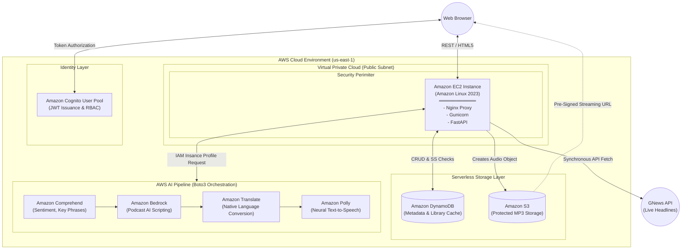

```mermaid
flowchart TB
    %% External Interfaces
    Client((Web Browser))
    GNews(("GNews API<br>(Live Headlines)"))

    %% AWS Cloud Environment
    subgraph AWS["AWS Cloud Environment (us-east-1)"]
        direction TB

        subgraph Network["Virtual Private Cloud (Public Subnet)"]
            subgraph Security_Group["Security Perimiter"]
                %% Core Application Host
                EC2["Amazon EC2 Instance<br>(Amazon Linux 2023)<br>═══════════<br>- Nginx Proxy<br>- Gunicorn<br>- FastAPI"]
            end
        end

        subgraph Authentication ["Identity Layer"]
            Cognito["Amazon Cognito User Pool<br>(JWT Issuance & RBAC)"]
        end

        subgraph Storage["Serverless Storage Layer"]
            DynamoDB[("Amazon DynamoDB<br>(Metadata & Library Cache)")]
            S3[("Amazon S3<br>(Protected MP3 Storage)")]
        end

        subgraph AI_Pipeline["AWS AI Pipeline (Boto3 Orchestration)"]
            direction LR
            Comprehend["Amazon Comprehend<br>(Sentiment, Key Phrases)"]
            Bedrock["Amazon Bedrock<br>(Podcast AI Scripting)"]
            Translate["Amazon Translate<br>(Native Language Conversion)"]
            Polly["Amazon Polly<br>(Neural Text-to-Speech)"]
            
            %% Pipeline Sequence
            Comprehend --> Bedrock
            Bedrock --> Translate
            Translate --> Polly
        end
    end

    %% Network & App Connections
    Client <-->|REST / HTML5| EC2
    EC2 -->|Synchronous API Fetch| GNews
    Client <-->|Token Authorization| Cognito

    %% Storage Interactions
    EC2 <-->|CRUD & SS Checks| DynamoDB
    EC2 -->|Creates Audio Object| S3
    S3 -.->|Pre-Signed Streaming URL| Client

    %% Engine Interactions
    EC2 <-->|IAM Insance Profile Request| AI_Pipeline
```